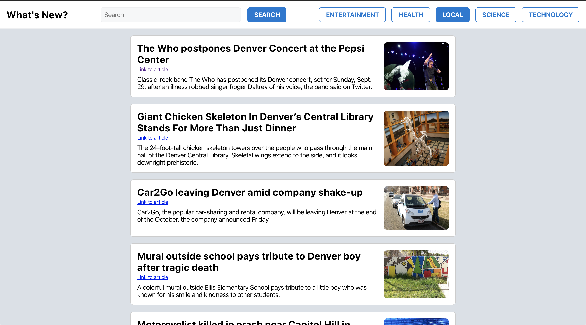

# What's New?
by Jonathan Tschida

## Overview
As part of the curriculum at the Turing School for Software and Design, during Mod 3 I was asked to create a basic news web application using the React framework.  The learning goals of the project were:
 - Learn to pass information between components using props.
 - Learn to write readable JSX.
 - Learn how to unit test React components including snapshot testing, methods, and changes in state.

## Screenshots
#### Comp Example

#### My Finished Comp

## Set up

1. `git clone` this repo
1. run `npm install` for dependencies
1. start the server with `npm start`
1. navigate to `localhost:3000/` if it doesn't do so automatically
